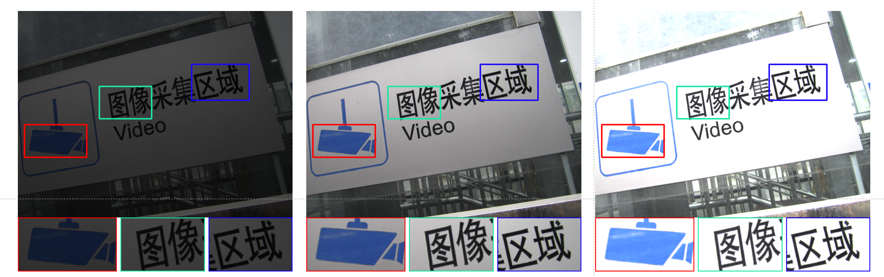
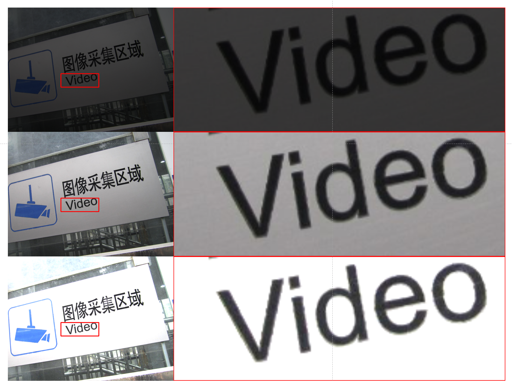

# PlotCubby - 图像区域放大工具

**PlotCubby** 是一个简单的论文绘图工具，专门用于创建图像区域的放大视图。它允许用户在图像上选择特定区域，并生成这些区域的放大视图，非常适合用于 **科学论文**、**技术文档**、**演示文稿** 等需要突出显示图像细节的场景。

---

## ✨ 功能特点

* 🔍 **多区域放大**：支持同时选择并放大最多 4 个不同区域
* 🎨 **自定义边框**：为每个放大区域设置不同的边框颜色和线宽
* 📐 **灵活布局**：放大区域可放在原图的上/下/左/右任意一侧
* 📁 **批量处理**：支持对同一文件夹下的多张同尺寸图片批量操作
* 🖼 **高质量输出**：使用双线性插值确保放大图像平滑自然
* 🧭 **交互式界面**：直观的参数设置对话框与保存选项
* ⚡ **实时预览**：框选区域时实时显示放大效果

---

## 🛠 安装要求

### 📦 依赖库

```bash
python >= 3.6  
opencv-python  
numpy  
pillow  
tkinter （通常随 Python 安装）
```

### 🔧 安装依赖

```bash
pip install opencv-python numpy pillow
```

---

## 🚀 使用说明

1. **启动程序**

   ```bash
   python plotcubby.py
   ```

2. **选择图片**
   启动后将弹出文件选择框，选择目标图像。

3. **参数设置**
   配置如下参数：

   * 放大区域个数（1-4）
   * 线宽（1-10 px）
   * 放大区域位置（上/下/左/右）
   * 区域间距
   * 各区域边框颜色 🎨

4. **选择放大区域**
   用鼠标左键框选感兴趣区域，依次完成所有设置的区域选择。

5. **保存结果**

   * 💾 保存当前结果
   * 🗂 保存并批量处理其他图片
   * ❌ 不保存，直接退出

---

## ⌨️ 快捷键

| 快捷键 | 功能说明           |
| ------ | ------------------ |
| `q`    | 退出程序           |
| `c`    | 取消当前选择       |
| `s`    | 保存当前结果       |
| `p`    | 重新打开参数设置框 |

---

## 📑 批量处理说明

📌 批量处理适用于对同一尺寸的图像应用相同的放大设置：

1. 在保存对话框中选择 **保存并批量处理其他图像**
2. 选择图片文件夹
3. 结果将保存至该目录下的 `Result/` 文件夹中

> ⚠️ **注意**：所有图像需尺寸一致，且文件名不同。

---

## 📷 效果展示

以下是 PlotCubby 在论文图像放大中的效果图示例：



---

## 💡 应用场景

* 🧪 科学论文：放大实验图像中的关键细节
* 🧑‍🏫 教学演示：幻灯片中细节展示更清晰

---

## ⚙️ 工作原理

1. 用户框选原图中的关注区域
2. 程序提取并放大区域内容
3. 添加边框，并按设定布局嵌入原图
4. 多区域时自动计算间距与排布方式

---

## ❓ 常见问题

**Q: 放大区域显示不完整？**
A: 区域不要贴近图像边缘，留出边框空间。

**Q: 批量处理出错？**
A: 确保图片尺寸一致，且仅包含图像文件。

**Q: 如何改变放大比例？**
A: 程序会根据图像尺寸和区域自动调整缩放比例。

---


